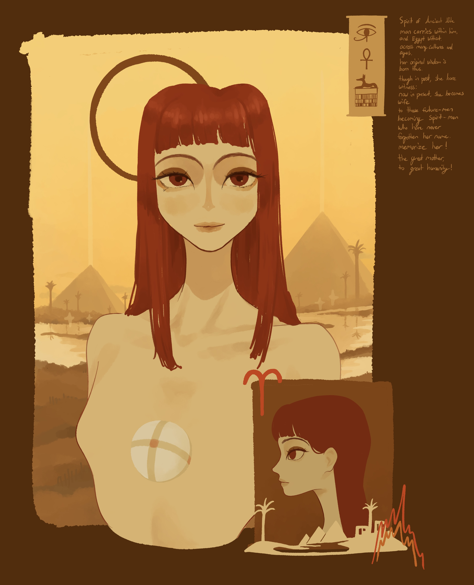

## Social-spiritual reform

"Hermeticism is the beginning of Sophism, as it is only through knowledge that you transcend.

The more you acquire higher knowledge, the closer you get to your lost heavenly part of yourself, lost when heaven was separated.

Earth... you become more human.

**The concept here is humanizing the universe.**

This place, the New Hermopolis is giving a chance for normal people to redefine themselves; the possibility to redefine one's identity; to redefine their community.

This is 'social alchemy,' based on the idea of self metamorphosis: the process of constant self transformation.

Simply, the divine individual will achieve the metamorphosis and redefine the ego."

(New Hermopolis)

...

"It is an attempt to regain the lost soul, like the idea of the Netro Neema Twelve: the lady who redeemed what Egypt Kemmet has lost. Her task was the concept of "Redemption." What is lost is the soul of Egypt. **This place [New Hermopolis] is trying to redeem the soul of Ancient Egypt.**

(New Hermopolis)

## Nile Wisdom

standing on rivers of might,

pyramids distant with etheric light.

spirits of Egypt come together,

her secret wisdom is available whenever.

(Spirit of Nile Verse 02 - 10 May 2026)

...

spirit of Ancient Nile,

man carries within him, and Egypt without.

across many cultures and ages,

her original wisdom is born thus.

though in past, she bore witness;

now in present, she becomes wife

to those future-men becoming spirit-men

who have never forgotten her name.

memorize her!

the great mother, to great humanity!

(Spirit of Nile Verse - 8 May 2026)

